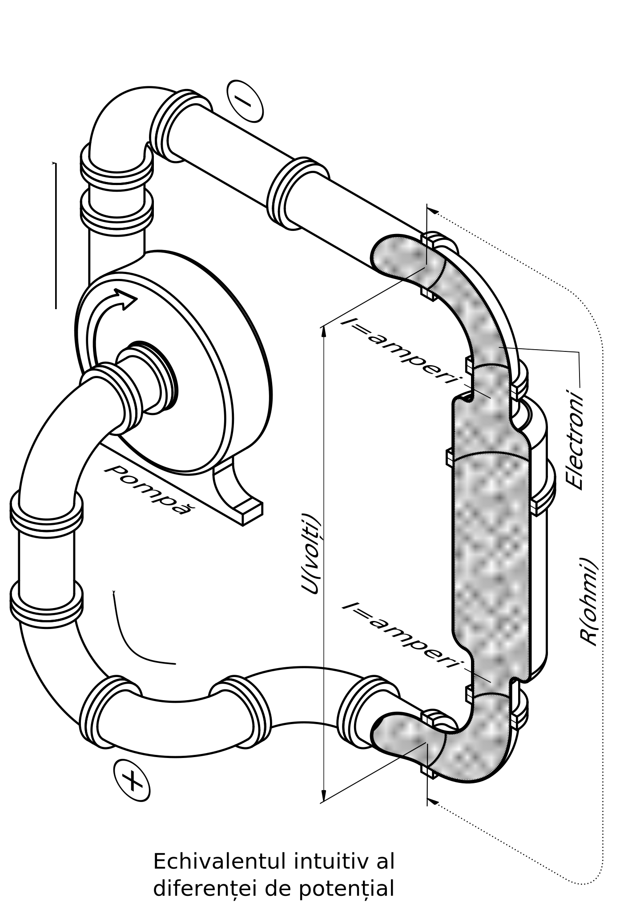

restitutio manualul-radioamatorului
===

- [restitutio manualul-radioamatorului](#restitutio-manualul-radioamatorului)
- [Descriere proiect](#descriere-proiect)
  - [Mai multe detalii](#mai-multe-detalii)
- [Ce ne propunem?](#ce-ne-propunem)
  - [Să reconstituim "Manualul radioamatorului" în format digital](#s%C4%83-reconstituim-%22manualul-radioamatorului%22-%C3%AEn-format-digital)
  - [Să creăm un model standardizat de redactare](#s%C4%83-cre%C4%83m-un-model-standardizat-de-redactare)
  - [Să atragem cât mai mulți voluntari](#s%C4%83-atragem-c%C3%A2t-mai-mul%C8%9Bi-voluntari)
  - [Să devenim o platformă de inițiere](#s%C4%83-devenim-o-platform%C4%83-de-ini%C8%9Biere)
- [Ce câștigăm](#ce-c%C3%A2%C8%99tig%C4%83m)
  - [Bani?](#bani)
  - [Experiență?](#experien%C8%9B%C4%83)
  - [Mulțumiri?](#mul%C8%9Bumiri)
  - [O lume mai bună?](#o-lume-mai-bun%C4%83)
- [Stadiul actual](#stadiul-actual)
- [Cum o să arate?](#cum-o-s%C4%83-arate)
- [INTRODUCERE](#introducere)
- [Partea întîi - ELEMENTE DE ELECTROTEHNICĂ ŞI RADIOTEHNICĂ](#partea-%C3%AEnt%C3%AEi---elemente-de-electrotehnic%C4%83-%C5%9Fi-radiotehnic%C4%83)
  - [Capitolul I](#capitolul-i)
    - [A. Fenomenele fundamentale şi legile curentului electric](#a-fenomenele-fundamentale-%C5%9Fi-legile-curentului-electric)
      - [1. Constituţia materiei. Electronul](#1-constitu%C5%A3ia-materiei-electronul)
      - [2. Unităţile de măsură. Semnificaţia și întrebuințarea lor](#2-unit%C4%83%C5%A3ile-de-m%C4%83sur%C4%83-semnifica%C5%A3ia-%C8%99i-%C3%AEntrebuin%C8%9Barea-lor)

# Descriere proiect

> Acest proiect este un demers pentru digitizarea cărții "Manualul radioamatorului". 
> Autori: Ing. MIHAI TANCIU, Ing. ION VIDRAȘCU; Editura Stadion, 1971

Referințe scanări: 
1. Sursa scribd.com
[https://www.scribd.com/document/137161505/Manualul-Radioamatorului-pdf](https://www.scribd.com/document/137161505/Manualul-Radioamatorului-pdf)
2. Sursa Victor Ioan (YO4BII)
[scan-output/manualul-radioamatorului-BUN-V-1.0-531pages-scan-Victor-Ioan.pdf](scan-output/manualul-radioamatorului-BUN-V-1.0-531pages-scan-Victor-Ioan.pdf)

## Mai multe detalii

Pentru o detaliere structurată a modului de lucru citește [https://github.com/matei-tm/manualul-radioamatorului/wiki](https://github.com/matei-tm/manualul-radioamatorului/wiki)

# Ce ne propunem?

## Să reconstituim "Manualul radioamatorului" în format digital

Manualul, editat în 1971, este un model excelent pentru reconstituire. Conține toate ingredientele necesare unui astfel de proiect:

- editat într-o perioadă în care tușul era rege iar mașina de scris regină
- interesant prin "clasicul" soluțiilor tehnice, ale unei perioade în care circuitul integrat nu îl găseai decât în laboratoarele marilor companii
- desene de "mână" excelent reprezentate

## Să creăm un model standardizat de redactare

Proiectul poate fi un șablon pentru reconstituirea unui manual tehnic. De asemenea ar putea fi un bun start pentru cei care doresc să genereze propria lor documentație tehnică.

## Să atragem cât mai mulți voluntari

 Proiectul își propune să atragă cât mai mulți voluntari care să contribuie în diferite părți:

- OCR/dactilografiere text
- Editare ecuații
- Reprezentare figuri
- Corectare ortografică
- Menționare greșeli
- Management proiect

## Să devenim o platformă de inițiere

Alăturându-vă colaboratorilor acestui proiect, puteți exersa o serie de sarcini cu care vă veți întâlni într-un proiect informatic (și nu numai):

- Management al proiectului
- Abordare top-bottom
- Abordare bottom-top
- Definire/înregistrare/urmărire obiective
- Înregistrare/urmărire/rezolvare erori
- Generare documentație text/2D/3D
- Versionare livrabile
- Utilizare eficientă a serviciului github

# Ce câștigăm

## Bani?

Dacă acesta este scopul pe care îl urmăriți, vă garantăm că nu vă putem ajuta! Nu acum! Poate vă putem oferi "undița" pentru câștigurile viitoare.

## Experiență?

Cu siguranță, da!

## Mulțumiri?

Probabil că da. Mai ales atunci când ne veți semnala o eroare. Mai mult decât atât, o să învățăm să-i apreciem pe cei care ne semnalează propriile greșeli.

## O lume mai bună?

Cred că da. În final, toată lumea o să fie câștigată. Redăm comunității radioamatorilor un manual de referință, învățăm să folosim unelte digitale de editare, lucrăm în echipă, avem o bază "open source" pentru alte referate/documente/articole.

"Sharing is Caring!"

# Stadiul actual

Vezi [output/DOCUMENT.md](output/DOCUMENT.md)

# Cum o să arate?

Cartea va fi formatată în sintaxă Markdown. Într-un viitor care depinde de noi va arăta cam așa...

# INTRODUCERE

Radioamatorismul - sportul îndrăgit de mulți - indiferent de vîrstă - reprezintă activitatea unde se cer îmbinate armonios efortul fizic
și inteligența, aptitudinile personale cu cunoştinţele teoretice solide, elanul tineresc cu avîntul imaginaţiei creatoare. 
Sportul acesta, care numără mulţi ani de cînd a luat ființă, s-a impus încet dar sigur, încît azi nu există continent unde să nu fie
prezent, nu există ţară care să nu aibă prefix propriu pentru radioamatorism, nu există oră din zi sau din noapte în care să nu găsești radioamatori de pe toate meridianele şi latitudinile globului practicînd acest frumos și pasionant sport. 
În comparație cu celelalte sporturi - chiar şi cu sportul „rege“, fotbalul - radioamatorismul este singurul în care „jucătorii“ nu se transformă la o anumită vîrstă în suporteri, ci râmîn „pe teren“ activi, „de la tinerețe pîn'la bătrînețe“. 
Într-un cuvînt, radioamatorismul este sportul puternic prin modestia lui (nu este zgomotos, nu „ridică tribunele în picioare“), mare prin cauzele nobile ale umanității în slujba cărora pune prietenia între popoare, apreciat şi admirat pentru serviciile aduse omenirii, indiferent de rasă, sex, neam, religie, vîrstă. Numeroasele cazuri de salvare a unei vieţi aflate în pericol, cu ajutorul unui lanț întreg de radioamatori din diferite țări, reprezintă cea mai frumoasă pildă de solidaritate colectivă pusă în slujba omului. lată de ce sportul acesta este îndrăgit îndeosebi de tineri entuziaşti. 
Activitatea de radioamatorism constă în stabilirea de legături cu radioamatori din ţara noastră sau din alte ţări, prin executarea traficului radio în telefonie sau în telegrafie. Executarea acestui trafic se face în conformitate cu Regulamentul de radiocomunicații al radioamatorilor din R.S.R. Pentru desfăşurarea acestei activităţi se folosesc aparate de radio, receptoare şi emițătoare speciale, de diferite puteri, corespunzătoare clasei de autorizare pe care o au radioamatorii.

[...]

# Partea întîi - ELEMENTE DE ELECTROTEHNICĂ ŞI RADIOTEHNICĂ

## Capitolul I

### A. Fenomenele fundamentale şi legile curentului electric

#### 1. Constituţia materiei. Electronul

[...]

Atomii moleculelor din care sînt alcătuite corpurile simple sau compuse nu au aceleași însușiri, deși toți atomii sînt formați din electroni și protoni. Într-o seamă de corpuri electronii sînt foarte statornici și cu greu se lasă scoși din îmbrățișarea microcosmosului lor. Din

 

 <i>Fig. 1</i>

familia acestora fac parte: sticla, porțelanul, cauciucul, mica, hîrtia, parafina, bachelita, masele plastice etc. Ele se numesc _izolanți_ sau _dielectrici_.  
[...]

#### 2. Unităţile de măsură. Semnificaţia și întrebuințarea lor
 

[...]

 

[...]

 

 <i>Fig. 4</i>

[...]

